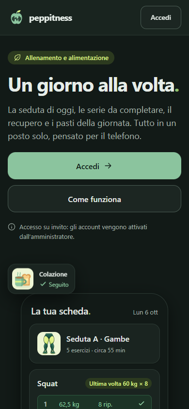
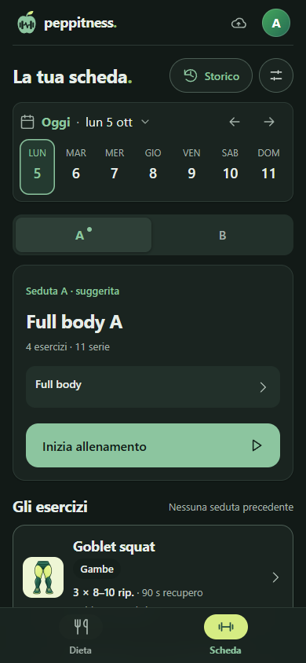
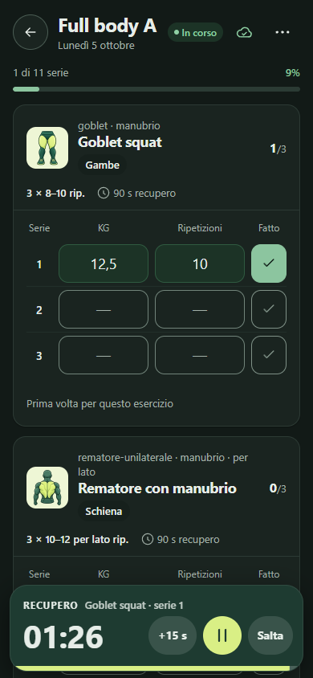
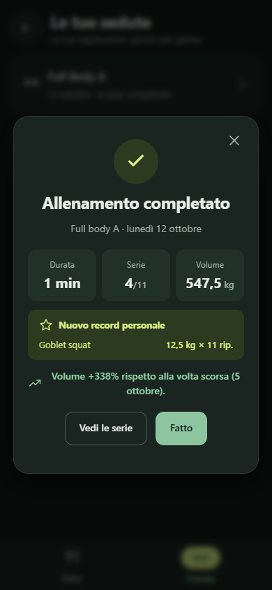

# peppitness

**Allenamento, alimentazione e progressi in un posto solo.**

PWA mobile-first per seguire una scheda di allenamento e un piano alimentare giorno per giorno: la seduta di oggi, le serie da completare, il recupero e i pasti della giornata.

<p align="center">
  
  
  
  
</p>

## Funzionalità

- **Allenamento**: programmi a cicli settimanali, serie e carichi registrati durante la seduta, timer di recupero con avviso, record personali e riepilogo a fine allenamento.
- **Alimentazione**: piano con periodo di validità, calorie stimate dagli alimenti e diario dei pasti.
- **Progressi**: costanza settimanale e andamento di ogni esercizio.
- **Importazione**: scheda e dieta da due modelli Word strutturati, letti sul dispositivo e confermati con un'anteprima modificabile.
- **Offline**: le registrazioni restano sul telefono e si sincronizzano quando torna la rete.

## Stack

- **Frontend**: React 19 + TypeScript, build con [Vite](https://vite.dev) e installabile come PWA (`vite-plugin-pwa`).
- **Backend**: [Supabase](https://supabase.com): Postgres con Row Level Security su ogni tabella, Auth e RPC atomiche per i salvataggi.

## Sicurezza

- **Autenticazione a due fattori** (TOTP con app di autenticazione). Quando è attiva, non la controlla solo l'interfaccia: le policy del database richiedono una sessione `aal2`.
- Ogni account vede solo i propri dati, garantito dalle policy RLS.
- Accesso su invito: niente registrazioni pubbliche.

## Backup automatici

Il piano Free di Supabase non include backup, quindi li fa una [GitHub Action](.github/workflows/backup.yml) ogni notte:

1. dump di schema e dati, in sola lettura;
2. prova di ripristino in un Postgres effimero in Docker, con confronto di hash e conteggi delle righe;
3. archivio cifrato con [age](https://age-encryption.org) (la chiave privata non lascia il mio PC) e conservato 30 giorni come artifact.

## Sviluppo

```bash
npm ci
cp .env.example .env   # URL e chiave pubblica del progetto Supabase
npm run dev        # server di sviluppo
npm test           # test unitari
npm run build:pwa  # build di produzione della PWA
```
